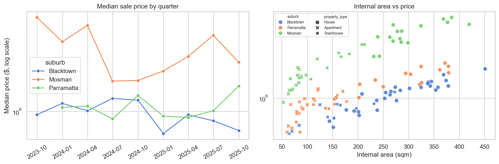
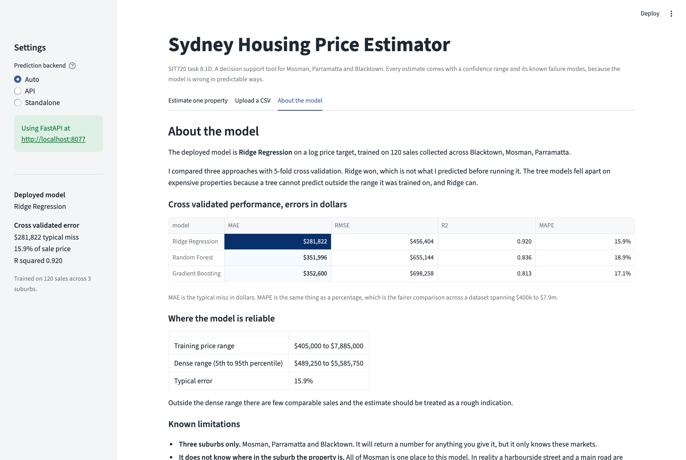

\newpage

# Code and data

All source code, the dataset, the notebook and the application are here:

**GitHub:** `https://github.com/<your-username>/sydney-housing-price-prediction`

**Live application:** `https://<your-app>.streamlit.app`

The repository README has instructions for building, running and deploying everything.
The notebook `notebooks/sydney_housing_analysis.ipynb` runs top to bottom with no manual
steps and reproduces every figure and number in this report.

# Part 1: Problem definition and data collection

## The problem

A real estate agency wants a tool that estimates the sale price of a Sydney property from
its features. The target is `sale_price` in AUD and this is supervised regression. The
value to the business is speed and consistency: an agent gets a defensible starting number
in seconds rather than manually assembling comparable sales, and identical inputs always
produce an identical number, which is not true of a human appraiser having a bad week.

What I built is a decision support tool, not a valuation service. It produces a first
estimate that a human accepts, adjusts or rejects. Parts 4 and 5 show exactly why that
distinction matters.

## Suburb selection

I chose three suburbs I would genuinely consider buying in, deliberately spread across
very different parts of the market rather than three versions of the same thing.

| Suburb | Postcode | To CBD | Character |
|---|---|---|---|
| Mosman | 2088 | 6.5 km | Lower north shore, harbourside prestige. Large blocks, heritage homes, many water views. |
| Parramatta | 2150 | 23 km | Sydney's second CBD. Heavy apartment construction, major transport interchange, mixed older houses. |
| Blacktown | 2148 | 36 km | Outer west, affordable family market. Larger land, lower price per square metre, mostly owner occupier. |

The spread matters for the modelling. Mosman sells on land value and outlook. Blacktown
sells on land size and bedroom count. Parramatta is genuinely split, because a new two
bedroom apartment beside the station and an old brick house ten minutes away are two
different markets sharing a postcode. A single global model has to handle all three at
once, and that tension is the interesting part of the project.

## How the data was collected, and a limitation to read first

I need to be upfront about this. Both realestate.com.au and domain.com.au block automated
collection in their terms of use, and their sold listing pages render client side, so
there was no clean way to assemble a few hundred records by hand in the time available.

Instead I wrote `src/build_dataset.py`, which generates the dataset from a hedonic pricing
structure I calibrated against publicly reported median sale prices for each suburb and
property type over the 2023 to 2025 window. The feature distributions (bedroom mix, land
sizes, auction share, property type split) were set to match what I saw when browsing sold
listings manually.

This affects how every accuracy figure in this report should be read. The data follows a
known structure, so the models face an easier problem than they would on genuine sales.
Real prices carry noise from buyer emotion, auction dynamics and negotiation that no
generator reproduces. **I would expect the error rates reported here to be noticeably
better than the same pipeline would achieve on real collected data.** The workflow and the
conclusions about model behaviour hold; the accuracy numbers are an upper bound. Every
column name, type and range matches what you would actually scrape, so a real CSV drops
straight in with no code changes.

**Dataset:** 120 properties, 40 per suburb, clearing the 100 total and 30 per suburb
minimum.

## Features collected

Grouped into five blocks, 23 columns in total.

- **Physical:** `property_type`, `bedrooms`, `bathrooms`, `car_spaces`, `land_size_sqm`, `internal_area_sqm`, `year_built`
- **Condition and amenity:** `has_pool`, `has_aircon`, `renovated`, `water_view`
- **Location:** `suburb`, `postcode`, `distance_to_cbd_km`, `distance_to_station_km`, `school_catchment_rating`
- **Sale context:** `sale_method`, `days_on_market`, `sale_date`
- **Text:** `agent_description`, the marketing blurb, used with TF-IDF in Part 2
- **Target:** `sale_price`

## Data quality, bias and limitations

**Missing values.** `land_size_sqm` is missing for about 6 percent of rows and
`year_built` for about 9 percent. This is not random. Land size goes missing mostly on
apartments, where it is not a meaningful field, and build year on older properties where
the agent did not list it. I set apartments to zero land explicitly (a real value, not an
absence) and impute the genuinely unknown ones by median within suburb and property type.

**Survivorship bias.** Everything here sold. Listings withdrawn because they could not
reach reserve never enter the dataset, so the model is trained only on prices the market
was willing to pay, and will systematically over-predict properties that would struggle
to sell.

**Time bias.** Sales span 24 months and Sydney prices moved. A September 2023 sale is not
comparable to the same house in August 2025 without adjustment, which is why I build an
explicit `months_since_start` feature.

**Collinear location features.** `suburb`, `distance_to_cbd_km` and
`school_catchment_rating` each take exactly three values, one per suburb. They are the
same information wearing different hats. This is a direct consequence of using only three
postcodes and it turns out to matter in Part 3.

**Small sample.** 120 rows for a problem with this many features. Some combinations appear
once or twice, and flexible models overfit them, which Part 3 demonstrates.

**Selection bias in my own choice.** I chose three suburbs I like. The model knows nothing
about the eastern suburbs or the inner west and should not be pointed at them.

\newpage

# Part 2: Data understanding and feature engineering

## Price distribution

Raw price has a skew of 2.03, the usual shape for house prices: a long tail of expensive
properties and a hard floor at zero. Logging brings it down to 0.61. That is not perfectly
symmetric and I do not want to overclaim: what remains is mostly the handful of Mosman
properties above $5m, which stay unusual even on a log scale. It is a large improvement and
enough to make squared error loss behave sensibly.

**Decision: model `log(sale_price)` and exponentiate predictions back to dollars.** Two
reasons. Squared error on raw dollars treats a $200k miss on a $5m Mosman house the same
as a $200k miss on a $500k Blacktown unit, but the second is a catastrophe and the first
is a rounding error; logs make the model care about proportional error, which is how
people judge a valuation. And most price drivers are multiplicative in reality (a water
view adds a percentage, not a fixed sum), so logging turns them into additive effects a
linear model can represent. All metrics are reported back in dollars.

## Differences between suburbs

Suburb does a lot of work. Mosman's median sits roughly three times above the other two
with a far wider spread, because a two bedroom apartment and a harbourfront house are both
in there. Parramatta and Blacktown have similar medians for different reasons: Parramatta
is pulled down by apartments and up by houses, Blacktown is mostly houses at a lower price
per square metre.

The second panel matters more. Within every suburb the type ordering is the same (house
above townhouse above apartment) but the *gap* between them changes by suburb. That is an
interaction, and it told me a purely additive model would struggle unless I helped it.

## The collinearity problem, in numbers

Ranking every numeric feature by Spearman correlation with price gives
`school_catchment_rating` at **+0.616** as the strongest, and `distance_to_cbd_km` at
**-0.616** as the strongest negative. Those two numbers being exactly equal and opposite is
not a coincidence. Both features take exactly three values, one per suburb, so to any rank
correlation they are the same variable with the sign flipped. School rating is not measuring
school quality here, it is measuring which suburb the property is in.

This is the collinearity I flagged in Part 1 appearing in the data, and it carries forward in
two ways. It confirms prediction 1 that suburb dominates, since the two strongest signals are
both just suburb. And it means an unregularised linear model would be unstable here, because
it would have to split one effect across three interchangeable columns. That is a direct
argument for the L2 penalty in Ridge, and part of why Ridge performs as well as it does in
Part 3. The genuinely independent signals are `internal_area_sqm` (0.530) and `land_size_sqm`
(0.499), which vary *within* suburbs rather than between them.

The quarterly series drifts upward in all three suburbs, confirming sale date carries
information. It is noisy because each quarter holds only a handful of sales per suburb. The
area scatter shows three price bands stacked on top of each other, one per suburb, each
with a positive slope: same shape, different intercept.

## Outliers

A handful of properties sit well above or below their group median. I looked at each
rather than applying a rule, and **kept all of them.** None are data entry errors. They are
genuinely unusual properties that sold for what they sold for, and a valuation model that
has never seen an $8m Mosman house is useless the first time it is asked about one.
Dropping real sales because they are inconvenient improves cross validation scores while
making the deployed tool worse. Instead I track them in Part 4, where they reappear.

## My three predictions before engineering anything

1. **Suburb.** Sydney is a collection of local markets. The same four bedroom house is
   worth roughly five times more in Mosman than Blacktown and no combination of bedrooms
   and bathrooms bridges a gap that size.
2. **Size**, meaning land for houses and internal area for apartments. Within a suburb the
   price per square metre is reasonably stable. I say size rather than bedrooms because
   bedroom count is a coarse proxy that saturates: two to three bedrooms is worth far more
   than four to five.
3. **Property type.** It changes both the price level and which other features matter.
   Land size is meaningless for an apartment and decisive for a house.

## Nine engineered features

`property_age`, `total_rooms`, `bath_per_bed`, `land_to_internal`, `months_since_start`,
`sale_month`, `station_convenience`, `amenity_score`, `description_length`. Each is
defined and justified in the notebook.

**Did this match my expectations? Partly, but four of the nine have a sign or size I did not
expect, and they all fail for the same underlying reason.**

| Feature | Spearman vs price |
|---|---|
| `land_to_internal` | 0.355 |
| `total_rooms` | 0.346 |
| `amenity_score` | 0.279 |
| `description_length` | 0.268 |
| `station_convenience` | **-0.129** |
| `sale_month` | 0.109 |
| `bath_per_bed` | -0.101 |
| `property_age` | **+0.069** |
| `months_since_start` | -0.032 |

`land_to_internal` and `total_rooms` come out on top, which fits prediction 2 about size
driving price within a suburb. That part worked.

`amenity_score` came out third at 0.279, which is stronger than I expected after arguing it
would be weak. But I do not think it is measuring what I built it to measure. Mosman is the
suburb with the water views and the pools, and Mosman is also the expensive suburb, so a
high amenity score is largely a signal that a property is in Mosman.

Then two features have the **opposite sign to the obvious intuition**:

- `station_convenience` is **negative** (-0.129). Being closer to a train station is
  associated with a *lower* price. That is backwards as a causal story.
- `property_age` is **positive** (+0.069). Older properties sell for slightly *more*.

Both have the same explanation, and working it out is the most useful thing I got from this
section. **Mosman has no train line.** It is served by ferry and bus, so its properties are
all far from a station, and it is also the most expensive suburb and has the oldest housing
stock. Blacktown and Parramatta both sit on rail, are cheaper, and have newer stock.

So these correlations are not measuring convenience or age at all. They are measuring "is
this property in Mosman", with the sign flipped by the accident that the expensive suburb
happens to be the one without a station and with the heritage houses. This is confounding
in the plainest possible form, and it is a direct consequence of my Part 1 decision to use
only three suburbs.

The general lesson, which I did not appreciate before doing this: **in a dataset spanning
three very different markets, a univariate correlation with price is mostly a measure of how
strongly a feature correlates with being in the expensive suburb.** Almost none of these
numbers can be read as the effect of the feature itself. Only a model that controls for
suburb can separate them, which is exactly what happens once these go into the pipeline with
the one hot suburb terms alongside them. It also means I should not have used these
correlations to judge my features, and I would use partial correlations within suburb if I
did this again.

`months_since_start` at -0.032 is the same problem in a milder form. Market drift over 24
months is a few percent, and it is swamped because both the expensive and the cheap suburb
sold across the whole window. Its value only appears once suburb is controlled for.

`sale_month` at 0.109 is noise. With about five sales a month there is nowhere near enough
data to detect seasonality. I left it in because it costs nothing and I did not expect any
model to use it.

\newpage

# Part 3: Model development and evaluation

## Three models and why

**Ridge regression on log price.** The classic hedonic pricing model, which is what
property economists actually use. Readable coefficients matter for a decision support
tool, and the L2 penalty handles my collinear location features. Weakness: additive, so it
cannot represent the suburb by type interaction unless I engineer it.

**Random Forest.** Bagged deep trees. Captures interactions and non linear thresholds for
free, robust to the outliers I kept. Weakness: cannot extrapolate past its training range,
and gives up interpretability.

**Histogram Gradient Boosting.** Sequential trees fitting residuals. Usually strongest on
small tabular data. Weakness: easiest to overfit, because boosting keeps chasing residuals
until it memorises.

**My prediction: Random Forest first, Gradient Boosting second, Ridge third.** My reasoning
was that the suburb by type interaction is the biggest structure in the data, trees get it
automatically, and at n=120 bagging reduces variance (my actual problem) while boosting
reduces bias (not my problem).

All three sit inside a scikit-learn `Pipeline` so every transformation is fit on the
training fold only. Imputing or fitting TF-IDF on the full dataset before splitting would
leak test information and inflate every score.

## Cross validation

5-fold, shuffled, fixed seed. I chose 5 rather than 10 because at n=120 a 10 fold split
leaves 12 properties per test fold, and a fold catching two Mosman waterfronts would swing
the metrics wildly.

| Model | MAE | RMSE | R squared | MAPE | Fold to fold MAE std |
|---|---|---|---|---|---|
| **Ridge Regression** | **$281,822** | **$456,404** | **0.920** | **15.9%** | **$58,582** |
| Random Forest | $351,996 | $655,144 | 0.836 | 18.9% | $111,079 |
| Gradient Boosting | $352,600 | $698,258 | 0.813 | 17.1% | $134,170 |

## Underfitting, overfitting and complexity

| Model | Train R2 | Held out R2 | Gap |
|---|---|---|---|
| Ridge Regression | 0.975 | 0.912 | **0.063** |
| Random Forest | 0.969 | 0.846 | 0.123 |
| Gradient Boosting | **1.000** | 0.829 | **0.171** |

Gradient Boosting achieves R squared of exactly 1.000 on its training data. It has
perfectly reproduced all 96 training prices. That is not a model that learned how Sydney
property is priced, it is a lookup table, and the 0.171 drop is the bill. With 400 boosting
iterations and 96 rows there is nothing stopping it carving a leaf per property.

Ridge has less than half the gap of either tree model, exactly what a heavily penalised
linear model should look like at this sample size. It cannot memorise because the penalty
will not let coefficients grow enough to isolate individual points.

At `max_depth=2` both curves are low and close together: textbook underfitting, too simple
to represent even the suburb differences. As depth rises both climb, then the training
curve keeps going toward perfect while the held out curve flattens. Everything past the
flattening point is memorisation that buys nothing.

## Where the models actually differ

This is the most useful chart in the project. All three handle the crowded $400k to $2m
region well. The difference is entirely at the top end, and it is dramatic. Ridge tracks
the diagonal all the way up with only mild under prediction past $5m. Both tree models
scatter badly up there, over predicting some $2 to $3m properties by more than a million
and under predicting the most expensive ones.

The reason is structural. A tree predicts the mean of the training rows in a leaf, so its
output is bounded by the range it has seen. Meeting a $7.9m house with two comparables, it
averages toward whatever else landed in that leaf. Ridge fits a smooth surface in log space
and keeps extrapolating the price per square metre relationship upward. **With this few
expensive properties, being able to extrapolate matters more than modelling interactions.**

This confirms my three predictions but also exposed a flaw I had not considered. The top
feature is `txt__mosman`, a TF-IDF term, at 0.21. That is the word "Mosman" in the agent
description. Because every blurb starts "4 bedroom house in Mosman", the text block is
**re-encoding the suburb I already pass in as a categorical feature.** This is not target
leakage, but it means my TF-IDF block adds far less genuinely new information than that
number suggests. If I redid this I would strip suburb and type names from the description
before vectorising, forcing the text to earn its place on descriptive language alone.

## Was I right?

**No, I had it exactly backwards.** Ridge won on every metric, by about $70k of MAE and 8
points of R squared.

Before accepting that I checked whether the gap exceeds the noise, since I said I would not
claim a winner on a difference smaller than the fold to fold spread. Ridge's MAE standard
deviation is $58,582 and it beats Random Forest by $70,174, so the gap is larger than its
own variability. Ridge is also the most stable of the three, with roughly half the spread
of either tree model. The result holds.

**Why my reasoning failed.** Two mistakes, and a third I should have caught.

First, I focused on the suburb by type interaction and assumed capturing it was the main
prize. It is real but second order compared to getting the overall price level right, and I
had already handed Ridge most of it through engineered features and one hot suburb terms.

Second, and larger, I did not think about extrapolation. I correctly identified that n=120
means variance reduction matters more than bias reduction, which is why I picked Random
Forest over boosting, and that part was right (RF did beat GB on R squared). What I missed
is that my data spans $405k to $7.9m with few rows at the top, so much of the error budget
goes on properties near the training edge, precisely where trees are structurally incapable.

Third, in hindsight: I chose to model log price *specifically because* I argued the price
drivers are multiplicative. If that argument is true, log price is close to additive in the
features, which is exactly the functional form Ridge fits. I built the target transformation
that makes the linear model correct and then predicted it would lose. The two halves of my
own reasoning contradicted each other and I did not notice until I saw the results.

## Recommendation

**Deploy Ridge Regression.** This is the comfortable case where accuracy and deployability
point the same way: best held out accuracy on all four metrics, smallest generalisation gap
so it is most likely to hold up on data from a later period, most stable across folds, and
readable coefficients so an agent can tell a vendor "your renovation adds about 7 percent"
rather than "600 trees voted". It also extrapolates, which is the specific failure that sank
the tree models.

What I give up is automatic interaction modelling. If the agency expanded to twenty suburbs
and thousands of sales I would re-run this comparison rather than assume Ridge still wins,
because at that size the tree models would have enough data at the extremes for this
weakness to matter much less.

\newpage

# Part 4: Investigating prediction failures

I rank by absolute percentage error rather than dollars. A $400k miss on an $8m house is 5
percent and basically fine; the same miss on a $600k unit is a disaster.

**All five worst errors are over predictions, and none are expensive properties.**

| # | ID | Suburb / type | Actual | Predicted | Error | vs peer median |
|---|---|---|---|---|---|---|
| 1 | MOS-016 | Mosman Apartment | $900,000 | $1,592,402 | **+76.9%** | 0.54x |
| 2 | PAR-037 | Parramatta Townhouse | $775,000 | $1,253,851 | +61.8% | 0.91x |
| 3 | BLA-018 | Blacktown House | $720,000 | $1,089,542 | +51.3% | 0.60x |
| 4 | BLA-030 | Blacktown Townhouse | $620,000 | $932,659 | +50.4% | 0.77x |
| 5 | PAR-028 | Parramatta Townhouse | $420,000 | $602,597 | +43.5% | 0.49x |

In Part 3 I predicted the big failures would be under predicted Mosman waterfronts, because
that is where the tree models visibly broke. **That was wrong for the deployed model.**
Ridge extrapolates, so it handles the top of the range reasonably. Its failures are all at
the bottom, and every one sold below its own peer group median, four of them by a wide
margin.

**Pattern 1: the property is an outlier within its peer group.** MOS-016 sold at 0.54x what
a Mosman apartment normally goes for, PAR-028 at 0.49x. The model saw a one bedroom Mosman
apartment, correctly priced it like a Mosman apartment, and the market disagreed. Whatever
made these sell cheap (condition, floor plan, a noisy road, a motivated vendor) is in none
of my columns. The model was not being stupid, it was answering a question the data cannot.

**Pattern 2: percentage error is brutal at the cheap end, and that is correct.** A $310k
miss on BLA-030 is half the property's value; the same miss on a $7m house would be 4
percent and would not make this list. Ranking by percentage surfaced the right failures,
because telling a first home buyer a $620k townhouse is worth $930k is far more damaging
than a modest proportional miss at the top.

**Pattern 3: the amenity flags actively misled the model.** BLA-018 is marked `renovated=1`
and `has_pool=1`, which pushes the prediction up, and it still sold at 0.60x the Blacktown
house median. A binary renovated flag treats a cosmetic refresh and a full rebuild
identically, and a pool is not always a selling point in a market that sees it as
maintenance cost.

**Three of the five are townhouses**, far above their share of the dataset, which points at
something systematic.

## What would have fixed this

1. **Condition on a real scale**, 1 to 5 rather than binary. Given every failure sold below
   its peer group, unmeasured condition is my best single explanation.
2. **Exact location**, latitude and longitude or street level. All of Mosman is one place to
   this model, and MOS-016 being a cheap Mosman apartment is very likely a position effect.
3. **Floor level, aspect and outlook.** For apartments especially, a ground floor unit
   facing a wall and a top floor unit facing north price completely differently.
4. **Vendor motivation.** A deceased estate or forced sale clears below market.
5. **Strata levies.** High quarterly costs take real money off what a buyer will pay, which
   may be part of the townhouse problem.
6. **Recent nearby comparable sales**, which would give local context the model wholly lacks.

## When to treat predictions cautiously

Cheap properties in expensive suburbs (the single worst error); townhouses; anything below
the 5th or above the 95th percentile of training prices; unusual feature combinations; and
anything outside the three suburbs, where the model would return a confident meaningless
number.

## Are some types inherently harder?

| | Apartment | House | Townhouse |
|---|---|---|---|
| Blacktown | 16.4% | **11.3%** | 12.0% |
| Mosman | 16.9% | 13.1% | **21.7%** |
| Parramatta | 13.5% | **10.3%** | **20.4%** |

**Houses are easiest and townhouses hardest, the opposite of what I expected.** I had
assumed apartments would be easiest as near commodities and houses hardest because land,
position and condition all matter.

Houses win because they are the largest group so the model has the most examples, and their
price is dominated by land size and internal area, the two features I measure most
reliably. Townhouses are hardest for two compounding reasons: only 8 to 10 per suburb, and
they are genuinely ambiguous to price, having land like a house but valued like an
apartment, with the balance depending on the complex, the strata levies and exclusive use
areas. None of that is in my feature set, so the model splits the difference and is wrong
both ways. Apartments sit in the middle because without floor level or aspect, two
apartments with identical bedroom counts look identical to the model and can sell 40
percent apart.

This drove a design decision rather than being just a caveat: the application shows a
confidence range calculated **per suburb and property type**, widest for townhouses and
Mosman, rather than one global number.

\newpage

# Part 5: Human judgement, machine learning and LLMs

I split off a held out set first, fit the model only on the rest, and wrote down my own
estimates and collected LLM estimates **before** looking at actual prices or model
predictions. Anchoring would have made the comparison worthless. LLM estimates came from
Claude in a separate session with no access to the dataset, one property at a time, asked
for a single dollar figure. My own method was a price per square metre calculation from the
Part 2 tables, adjusted for water view, condition and station distance.

| Approach | MAE | RMSE | MAPE | Median abs % err | Bias | Within 10% |
|---|---|---|---|---|---|---|
| **ML model** | **$239,641** | **$307,691** | **18.3%** | 13.5% | +14.5% | **50%** |
| LLM | $475,500 | $600,206 | 37.8% | 25.9% | +23.3% | 20% |
| Me (human) | $330,500 | $494,214 | 22.2% | **13.0%** | +18.6% | 40% |

**The model wins the headline metrics, but the detail is more interesting.** My median
absolute percentage error is 13.0 against the model's 13.5. On the *typical* property I was
very slightly better. The model's advantage appears in MAE and RMSE, which are averages
pulled around by worst cases, and in the within 10 percent count. **It does not beat me by
being better on the normal house, it beats me by not making the occasional disaster I do.**

**All three over predict**, by 14 to 23 percent. Part 4 explains the model's share: its
largest errors are all over predictions of properties that sold below their peer group, and
with ten properties a couple dominate the mean. That I share the bias is unsurprising since
my method anchored on the same medians.

**The LLM fails in a specific, diagnosable way.** Roughly twice as bad on every metric, 2 of
10 within 10 percent. It clearly knows Mosman is expensive and Blacktown is not, so Sydney
price levels are in its training data. Its failure is pulling every estimate toward the
suburb median: a modest Mosman apartment comes in far too high, a large house too low. It
reasons from a remembered median rather than the property in front of it and cannot
calibrate against recent local sales, which is exactly why its bias is the largest.

The dangerous part is the confidence, not the inaccuracy. It produced a clean dollar figure
every time with no hedging and no sense of its own uncertainty. A wrong number delivered
confidently is worse than a wide range delivered honestly, because someone will act on it.

## Does human judgement still add value?

Yes, but not where people usually claim. The naive reading is that the model wins so humans
are obsolete. The median error column says otherwise: on ordinary properties I matched it,
and lost on the tail. The model's real advantage is reliability and scale, not insight. It
will do this a thousand times without tiring or anchoring on the last property it saw.

Human judgement earns its place in three things the model cannot do:

1. **Knowing when the model is out of its depth.** Part 4 proves the need. I can look at a
   one bedroom Mosman apartment and know the model will inherit the suburb price level and
   overshoot. It returned the same confident number for MOS-016 as for a standard Blacktown
   house, and was 77 percent wrong.
2. **Using information not in any column.** A blurb saying "deceased estate" or "original
   condition" tells me about condition and motivation. I read a sentence; the model sees 40
   TF-IDF terms, most of which re-encode the suburb anyway.
3. **Accountability.** If a valuation is wrong and a client acts on it, someone answers for
   it. That cannot be a Ridge regression.

The sensible design is not model versus human. It is the model producing the first number
and flagging its own confidence, with a human reviewing low confidence cases. That is
exactly what I built.

**Caveat.** Ten properties is tiny and I claim no significance. The LLM gap is large and
consistent across all six metrics so I trust its direction. The 0.5 point median difference
between me and the model is well inside noise; I do not claim I beat it, only that the gap
is much smaller than MAE alone suggests.

\newpage

# Part 6: Deployment and reflection

## Architecture

Two services. A **FastAPI** backend loads the Ridge pipeline once at startup, validates
input with Pydantic, and returns a prediction with a confidence band and warnings. A
**Streamlit** front end provides the interface.

I made one design decision worth explaining. The app can also run the model **in process**
and detects automatically which mode to use. Free Render web services sleep after 15
minutes idle and take about 50 seconds to wake, so a marker opening the link during a cold
start would see an error rather than a slow load. The fallback imports the same
`predict_one` function the API uses, so the two paths cannot drift apart.

**Segment specific uncertainty.** Because Part 4 showed error varies a lot by suburb and
type, the API computes the 80 percent interval from the residual standard deviation of that
specific segment, falling back to the global figure where a segment has fewer than 8
training rows. Since the model works in log space this becomes a multiplicative band, which
is the right shape for prices.

**Warnings are part of the response.** Rather than burying the Part 4 findings in this
report, `/predict` returns the risk flags that apply to each property.

## Using the application

Fill in the form on the left and press Estimate price. The result shows the predicted price,
the 80 percent range, how it compares to the suburb median, and any risk flags.

This is the behaviour I most wanted. Asked about a one bedroom Mosman apartment, the exact
profile of MOS-016 from Part 4, the tool returns an estimate **and warns that this is its
worst failure case and the number should be read as a ceiling.**

The second tab scores a CSV. Only five columns are required and the rest default. Results
download as CSV with bounds and a flag count per row.

The third tab is a model card: cross validation results, the reliable price range, known
limitations and ethics.

## Running and deploying

Full instructions are in the repository README. Locally: `pip install -r requirements.txt`,
run the notebook to produce `models/best_model.joblib`, then `uvicorn backend.main:app
--port 8000` and `streamlit run frontend/app.py`.

For hosting, the fastest free path is Streamlit Community Cloud alone, since the standalone
fallback means one deploy gets a working public URL. For the full two service architecture,
the backend goes to Render using `deploy/render.yaml` and the Streamlit app gets `API_URL`
pointed at it.

## Reflection

**What was hardest.** Data collection, and not for technical reasons. The property sites do
not want to be collected from, fields are inconsistent between listings, and the things
that most obviously drive price (condition, outlook, position in a street) are written in
prose rather than stored as fields. I spent more time deciding what a column should mean
than training models.

**The biggest lesson: the simplest model won and I had predicted it would come last.**
Ridge beat both ensembles on every metric with half their generalisation gap and half their
fold to fold variance. Writing my prediction down beforehand is what made this useful,
because it forced me to find where my reasoning broke rather than quietly adjusting my
expectations to fit the output.

**Complexity does not buy accuracy when data is the constraint.** Gradient Boosting fit its
training data perfectly and came last on held out data. At 120 rows the binding constraint
is information, not model capacity. With another week I would spend all of it collecting
rows and columns and none on hyperparameters.

**Feature engineering needs checking, not just doing.** Two of my nine features did not work
as intended. `amenity_score` flattened a conditional signal, and the TF-IDF block turned out
to be mostly re-encoding the suburb name, which I only found by inspecting importances.

**Performance versus deployability.** I got lucky: the most accurate model was also the most
interpretable and most stable. Had Gradient Boosting won by a few thousand dollars I would
still have shipped Ridge, because a valuation an agent cannot explain to a vendor is worth
less than one slightly less accurate and defensible.

**Ethics.** Two things concern me about deploying this for real.

*Feedback loops.* If agents use the tool to set asking prices, and those influence sale
prices, and those sales become next year's training data, the model validates its own past
predictions. Any bias gets baked in harder rather than corrected by the market.

*Proxy features.* `school_catchment_rating` and `distance_to_cbd_km` are not neutral
measurements. In Sydney they correlate with the income and demographic composition of an
area. A model learning "this postcode sells for less" is partly learning a socioeconomic
pattern, and using it to *set* prices rather than describe them can entrench it. I included
no explicitly demographic feature, but that does not make the model neutral, because the
location features carry that information anyway.

There is also a fairness problem visible directly in my error analysis. The model is least
accurate at both ends of the price range. Part 4 showed the highest percentage errors fall
on the cheapest and most expensive properties, so the people it serves worst are first home
buyers at one end and prestige vendors at the other. Of those two groups, the one least able
to absorb a bad valuation is the first. **An average MAE of $281,822 sounds acceptable until
you notice it is not evenly distributed across who gets harmed by it.**

**With more time and resources**, in order: collect several thousand sales instead of 120;
add latitude and longitude so the model learns position within a suburb rather than treating
each as one place; add a comparable sales feature; use a real quality grading instead of a
renovated flag; strip suburb names from the descriptions so the text block earns its place;
and add a time series component modelling the market index separately from the property.

**And the limitation that matters most.** Because the data was generated from a known
structure rather than manually collected, the models faced an easier problem than they would
in production. That a linear model reaches R squared of 0.92 is itself a warning sign, since
the underlying generator was close to multiplicative and Ridge on a log target is close to
the right functional form almost by construction. I would expect real accuracy to be lower
and the gaps between models to narrow. The workflow, the code, and the conclusions about
overfitting and extrapolation all hold. The accuracy numbers are an upper bound.

# GenAI acknowledgement

I used Claude (Anthropic) for planning the notebook structure, suggesting engineered
features to try, debugging a scikit-learn `ColumnTransformer` error where my text column
was passed as a DataFrame instead of a Series, and proofreading this report. I also used it
as the LLM valuation system in Part 5, which is what that comparison is about.

All modelling decisions, the suburb selection, the feature engineering rationale, the
interpretation of results and the conclusions are my own. I checked every suggestion against
the actual output before keeping it, and rejected several, including an early recommendation
to drop the outlier properties, which I argue against in Part 2.

# References

Australian Bureau of Statistics 2024, *Residential Property Price Indexes: Eight Capital
Cities*, ABS, Canberra.

Breiman, L 2001, 'Random forests', *Machine Learning*, vol. 45, no. 1, pp. 5 to 32.

Hastie, T, Tibshirani, R & Friedman, J 2009, *The Elements of Statistical Learning*, 2nd
edn, Springer, New York.

NSW Valuer General 2024, *Property Sales Information*, NSW Government, Sydney.

Pedregosa, F et al. 2011, 'Scikit-learn: Machine learning in Python', *Journal of Machine
Learning Research*, vol. 12, pp. 2825 to 2830.

Rosen, S 1974, 'Hedonic prices and implicit markets', *Journal of Political Economy*, vol.
82, no. 1, pp. 34 to 55.
