\newpage

# Code, data and application

**GitHub:** https://github.com/BHASKAR-02/sydney-housing-price-prediction

**Live application:** https://sydney-housing-price-prediction.streamlit.app/

The repository holds the dataset, the notebook, the FastAPI backend, the Streamlit app and
build instructions. `notebooks/sydney_housing_analysis.ipynb` runs top to bottom with no
manual steps and reproduces every figure and number below. This report is the summary; the
notebook carries the full working.

# Part 1: Problem definition and data collection

A real estate agency wants an estimate of a property's sale price from its features, so the
target is `sale_price` in AUD and this is supervised regression. The value is speed and
consistency: an agent gets a defensible starting number in seconds and identical inputs
always give the same answer. It is a decision support tool, not a valuation service, and
Parts 4 and 5 show why that distinction matters.

**Suburb selection.** Three suburbs I would consider buying in, spread across different
markets.

| Suburb | Postcode | To CBD | Character |
|---|---|---|---|
| Mosman | 2088 | 6.5 km | Harbourside prestige. Large blocks, heritage homes, many water views. |
| Parramatta | 2150 | 23 km | Sydney's second CBD. Heavy apartment construction, major interchange. |
| Blacktown | 2148 | 36 km | Outer west, affordable family market. Larger land, lower price per sqm. |

The spread matters. Mosman sells on land value and outlook, Blacktown on land size and
bedroom count. Parramatta is genuinely split: a new apartment beside the station and an old
brick house ten minutes away are two markets sharing a postcode. One global model has to
handle all three, and that tension drives the rest of the project.

**How the data was collected, and the limitation to read first.** Both realestate.com.au and
domain.com.au block automated collection in their terms of use and render sold listings
client side, so I could not assemble a few hundred records cleanly. `src/build_dataset.py`
generates the dataset instead, from a hedonic pricing structure calibrated against published
median sale prices per suburb and property type for 2023 to 2025, with feature distributions
matched to sold listings I browsed by hand.

This changes how every accuracy figure here should be read. The data follows a known
structure, so the models face an easier problem than real sales would pose. **I would expect
the error rates below to be noticeably better than this pipeline would achieve on genuinely
collected data.** The workflow and the conclusions about model behaviour hold; the accuracy
numbers are an upper bound. Column names and ranges match what you would scrape, so a real
CSV drops in unchanged.

**Dataset:** 120 properties, 40 per suburb, clearing the 100 total and 30 per suburb minimum.
23 columns covering physical attributes, condition and amenity flags, location, sale context,
the agent's blurb as text, and the target. The full schema is in `data/data_dictionary.md`.

**Quality, bias and limitations.** Missing values are not random: `land_size_sqm` (6 percent)
goes missing mostly on apartments where it is meaningless, `year_built` (9 percent) on older
stock. I set apartment land to zero explicitly, a real value rather than an absence, and
impute the rest by median within suburb and type. Everything here *sold*, so withdrawn
listings are invisible and the model will over-predict properties that would struggle to find
a buyer. Sales span 24 months during which prices moved, hence the `months_since_start`
feature. `suburb`, `distance_to_cbd_km` and `school_catchment_rating` each take three values,
one per suburb, so they are the same information three times over, which matters in Part 3.
And 120 rows is small for this many features.

\newpage

# Part 2: Data understanding and feature engineering

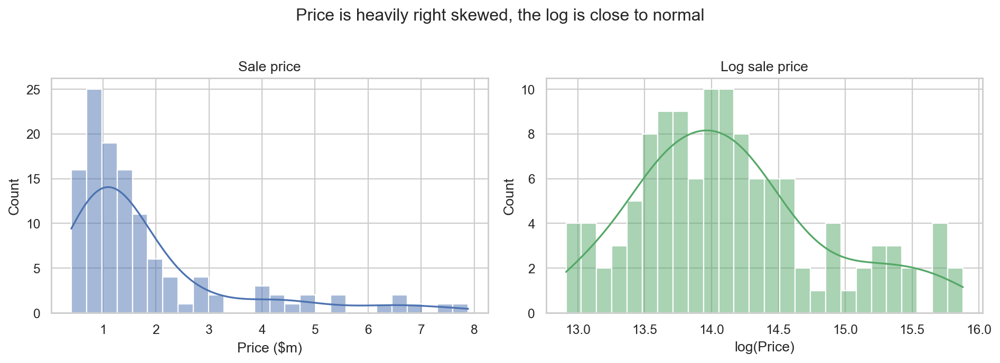

Price skew is 2.03, the usual shape for housing. Logging brings it to 0.61: not perfectly
symmetric, but what remains is the handful of Mosman properties above $5m, which stay unusual
on any scale.

**Decision: model `log(sale_price)` and exponentiate back to dollars.** Squared error on raw
dollars treats a $200k miss on a $5m house the same as on a $500k unit, but the second is a
catastrophe and the first a rounding error; logs make the model care about proportional
error, which is how people judge a valuation. Price drivers are also multiplicative (a water
view adds a percentage, not a fixed sum), so logging turns them into additive effects a
linear model can represent. All metrics are reported back in dollars.

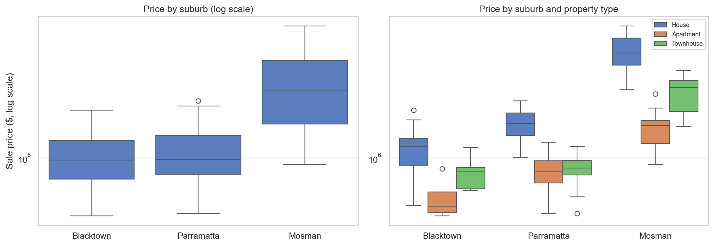

Mosman's median sits about three times above the other two with a far wider spread. The
second panel matters more: within every suburb the type ordering is identical, but the *gap*
between types changes by suburb. That interaction suggested a purely additive model would
struggle.

**The collinearity problem, in numbers.** Ranking features by Spearman correlation with price
puts `school_catchment_rating` top at **+0.616** and `distance_to_cbd_km` bottom at
**-0.616**. Those being exactly equal and opposite is not a coincidence: both take three
values, one per suburb, so to a rank correlation they are one variable with the sign flipped.
School rating is not measuring schools, it is measuring which suburb the property is in. This
confirms prediction 1 below, and it means an unregularised linear model would be unstable
here, splitting one effect across three interchangeable columns. That is a direct argument
for the L2 penalty in Ridge. The genuinely independent signals are `internal_area_sqm`
(0.530) and `land_size_sqm` (0.499), which vary *within* suburbs.

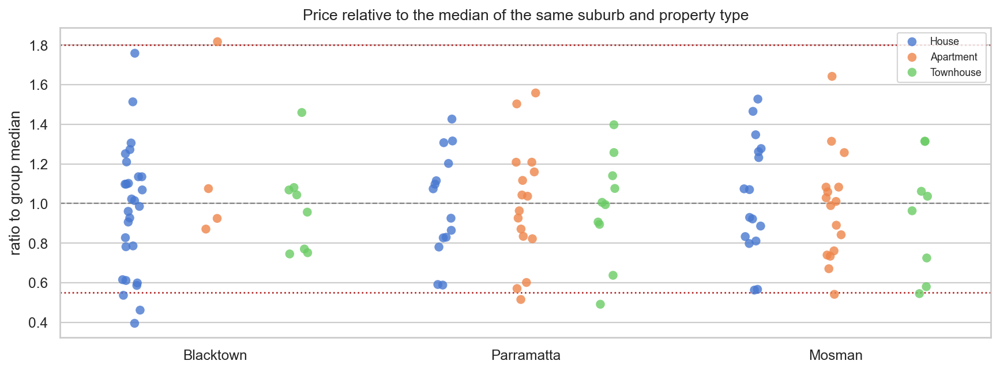

**Outliers: I kept all of them.** None are data entry errors; they are unusual properties
that genuinely sold for what they sold for. A model that has never seen an $8m Mosman house
is useless the first time it is asked about one. Dropping real sales improves cross
validation scores while making the deployed tool worse. They reappear in Part 4.

**My three predictions before engineering anything.** (1) **Suburb**, because Sydney is a
collection of local markets and no combination of bedrooms bridges a five-fold gap. (2)
**Size**, meaning land for houses and internal area for apartments; I say size rather than
bedrooms because bedroom count saturates. (3) **Property type**, which changes both the price
level and which other features matter.

**Nine engineered features:** `property_age`, `total_rooms`, `bath_per_bed`,
`land_to_internal`, `months_since_start`, `sale_month`, `station_convenience`,
`amenity_score`, `description_length`, each justified in the notebook.

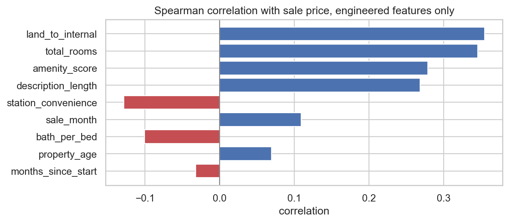

| Feature | Spearman | | Feature | Spearman |
|---|---|---|---|---|
| `land_to_internal` | 0.355 | | `sale_month` | 0.109 |
| `total_rooms` | 0.346 | | `bath_per_bed` | -0.101 |
| `amenity_score` | 0.279 | | `property_age` | **+0.069** |
| `description_length` | 0.268 | | `months_since_start` | -0.032 |
| `station_convenience` | **-0.129** | | | |

**Did this match my expectations? Partly, and the mismatches taught me more than the hits.**
`land_to_internal` and `total_rooms` came top, fitting prediction 2. But two features carry
the **opposite sign to intuition**: closer to a station means a *lower* price, and older
properties sell for slightly *more*.

One explanation covers both. **Mosman has no train line**, being ferry and bus served, and it
also holds the oldest stock and the highest prices, while Blacktown and Parramatta sit on
rail and are cheaper and newer. These correlations measure "is this Mosman", with the sign
flipped by that accident. The lesson: **across three very different markets, a univariate
correlation with price mostly measures how strongly a feature correlates with being in the
expensive suburb.** I should not have judged features this way, and would use partial
correlations within suburb next time. `amenity_score` at 0.279 looks strong for the same
reason, since Mosman holds the water views and pools.

\newpage

# Part 3: Model development and evaluation

**Ridge on log price**, the classic hedonic model, chosen for readable coefficients and
because the L2 penalty handles the collinearity above; its weakness is that it is additive
and cannot represent the suburb-by-type interaction unless I engineer it. **Random Forest**,
which gets interactions free and tolerates the outliers I kept, but cannot extrapolate past
its training range. **Histogram Gradient Boosting**, usually strongest on small tabular data
but easiest to overfit.

**My prediction: Random Forest first, Gradient Boosting second, Ridge third**, reasoning that
the interaction is the biggest structure in the data and that at n=120 bagging reduces
variance (my problem) while boosting reduces bias (not my problem).

All three sit in a `Pipeline` so every transformation fits on the training fold only;
imputing or fitting TF-IDF before splitting would leak test information. 5-fold rather than
10, since 12 properties per fold would swing the metrics.

| Model | MAE | RMSE | R² | MAPE | Fold-to-fold MAE std | Train R² | Gap |
|---|---|---|---|---|---|---|---|
| **Ridge Regression** | **$281,822** | **$456,404** | **0.920** | **15.9%** | **$58,582** | 0.975 | **0.063** |
| Random Forest | $351,996 | $655,144 | 0.836 | 18.9% | $111,079 | 0.969 | 0.123 |
| Gradient Boosting | $352,600 | $698,258 | 0.813 | 17.1% | $134,170 | **1.000** | **0.171** |

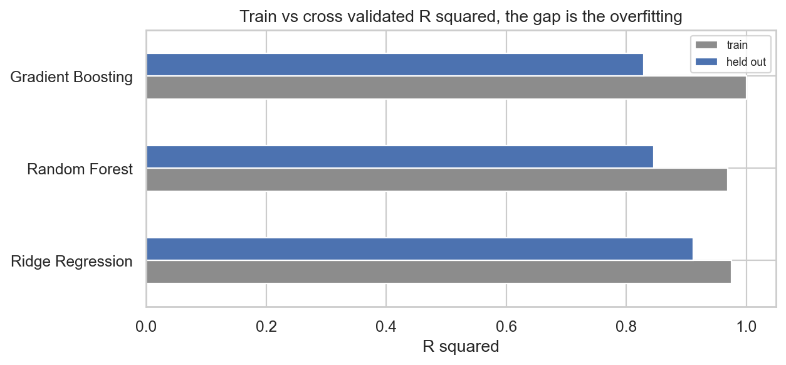

**Gradient Boosting reaches a training R² of exactly 1.000.** It reproduced all 96 training
prices perfectly. That is not a model that learned how property is priced, it is a lookup
table, and the 0.171 drop is the bill. Ridge has less than half the gap of either tree model,
which is what a heavily penalised linear model should look like at this sample size.

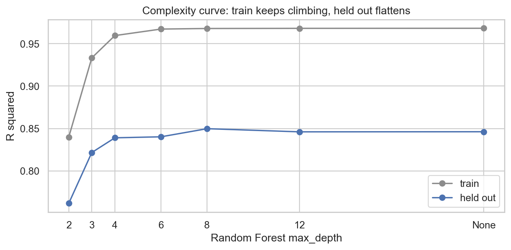

The complexity curve shows the same thing directly. At `max_depth=2` both curves are low and
close: underfitting. As depth rises both climb, then the training curve keeps going toward
perfect while the held out curve flattens. Everything past that point is memorisation.

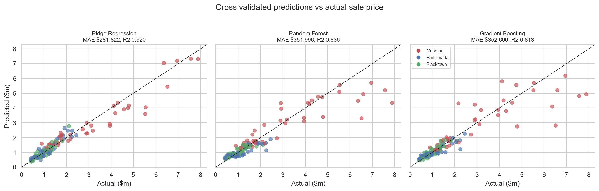

**This chart explains the result.** All three handle the crowded $400k to $2m region well.
The difference is entirely at the top. Ridge tracks the diagonal the whole way with mild
under prediction past $5m; both tree models scatter badly, over-predicting some $2 to $3m
properties by more than a million and under-predicting the most expensive. The cause is
structural: a tree predicts the mean of the rows in a leaf, so its output is bounded by the
range it has seen. Ridge fits a smooth surface in log space and keeps extrapolating. **With
this few expensive properties, extrapolating matters more than modelling interactions.**

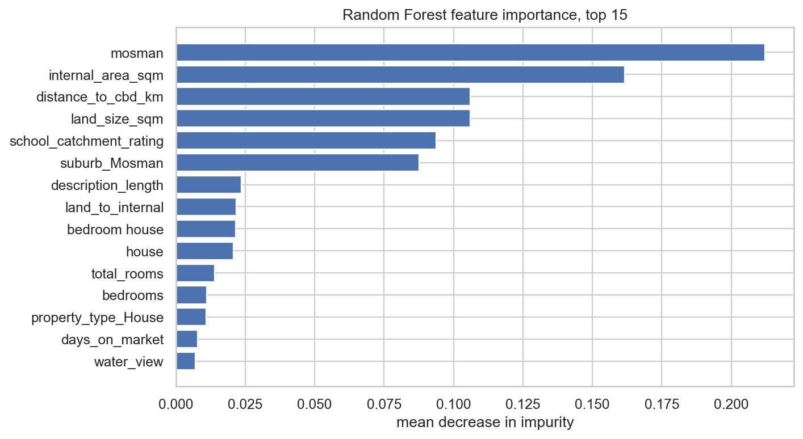

Feature importance confirmed the three predictions but exposed a flaw. The top feature is
`txt__mosman`, a TF-IDF term, at 0.21. Because every blurb begins "4 bedroom house in
Mosman", **the text block is re-encoding the suburb I already pass in as a categorical.** Not
target leakage, but my TF-IDF block adds far less new information than that number suggests.
I would strip suburb and type names before vectorising next time.

**Was I right? No, I had it exactly backwards.** Ridge won on every metric by about $70k of
MAE. I said I would not claim a winner on a gap smaller than the fold-to-fold spread: Ridge's
MAE standard deviation is $58,582 and it beats Random Forest by $70,174, so the gap exceeds
its own variability, and Ridge is also the most stable of the three. The result holds.

Three mistakes. I treated the suburb-by-type interaction as the main prize when it is second
order and already handed to Ridge through the engineered features. More importantly **I did
not think about extrapolation**: the data spans $405k to $7.9m with few rows at the top, so
much of the error budget falls exactly where trees are structurally incapable. And I chose a
log target *because* I argued price drivers are multiplicative, which makes log price
near-additive, which is precisely what Ridge fits. I built the transformation that makes the
linear model correct, then predicted it would lose.

**Recommendation: deploy Ridge.** Best on all four metrics, smallest generalisation gap, most
stable across folds, it extrapolates, and its coefficients let an agent say "your renovation
adds about 7 percent" rather than "600 trees voted". At twenty suburbs and thousands of sales
I would re-run this, since the tree models' weakness here would shrink.

\newpage

# Part 4: Investigating prediction failures

I rank by percentage error, not dollars: a $400k miss on an $8m house is 5 percent and fine;
the same miss on a $600k unit is a disaster. **All five worst errors are over-predictions,
and none are expensive properties.**

| # | ID | Suburb / type | Actual | Predicted | Error | vs peer median |
|---|---|---|---|---|---|---|
| 1 | MOS-016 | Mosman Apartment | $900,000 | $1,592,402 | **+76.9%** | 0.54x |
| 2 | PAR-037 | Parramatta Townhouse | $775,000 | $1,253,851 | +61.8% | 0.91x |
| 3 | BLA-018 | Blacktown House | $720,000 | $1,089,542 | +51.3% | 0.60x |
| 4 | BLA-030 | Blacktown Townhouse | $620,000 | $932,659 | +50.4% | 0.77x |
| 5 | PAR-028 | Parramatta Townhouse | $420,000 | $602,597 | +43.5% | 0.49x |

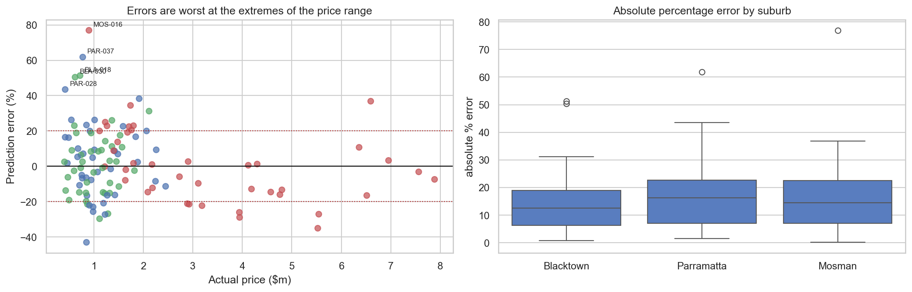

In Part 3 I expected the big failures to be under-predicted Mosman waterfronts, because that
is where the tree models broke. **That was wrong for the deployed model.** Ridge extrapolates,
so it handles the top adequately; its failures are all at the bottom, and every one sold
below its own peer median.

**Three patterns.** These are outliers *within* their peer group: MOS-016 sold at 0.54x what
a Mosman apartment normally fetches, so the model priced it correctly as a Mosman apartment
and the market disagreed, because whatever made it cheap is in none of my columns.
Percentage error is brutal at the cheap end, which is correct, since telling a first home
buyer a $620k townhouse is worth $930k is far more damaging than a proportional miss at the
top. And **the amenity flags actively misled the model**: BLA-018 is marked `renovated=1`
and `has_pool=1`, pushing the prediction up, yet sold at 0.60x the Blacktown median, because
a binary flag treats a cosmetic refresh and a full rebuild identically.

**Three of the five are townhouses**, well above their share.

**What would have fixed this**, in order of value: condition on a 1 to 5 scale rather than
binary, since every failure sold below its peer group; exact location, because all of Mosman
is one place to this model; floor level and aspect for apartments; vendor motivation; strata
levies; and recent nearby comparable sales.

**Treat predictions cautiously** for cheap properties in expensive suburbs, townhouses,
anything outside the 5th to 95th percentile, unusual feature combinations, and anything
outside the three suburbs, where the model returns a confident meaningless number.

**Are some types inherently harder?** Median absolute percentage error:

| | Apartment | House | Townhouse |
|---|---|---|---|
| Blacktown | 16.4% | **11.3%** | 12.0% |
| Mosman | 16.9% | 13.1% | **21.7%** |
| Parramatta | 13.5% | **10.3%** | **20.4%** |

**Houses are easiest and townhouses hardest, the opposite of what I expected**, having
assumed apartments would be easiest as near-commodities. Houses win because they are the
largest group and their price is dominated by land and internal area, the two things I
measure best. Townhouses are hardest because there are only 8 to 10 per suburb *and* they are
genuinely ambiguous: land like a house, valued like an apartment, with the balance set by
strata arrangements my features cannot express. Apartments sit in the middle because without
floor level or aspect, two units with identical bedroom counts can sell 40 percent apart.

This drove a design decision rather than a caveat: the application computes its confidence
range **per suburb and property type**, widest for townhouses and Mosman.

\newpage

# Part 5: Human judgement, machine learning and LLMs

I split off the held out set first, fit the model on the rest, and recorded my own estimates
and the LLM's **before** seeing actual prices or model output, since anchoring would void the
comparison. LLM estimates came from Claude in a separate session with no access to the
dataset, one property at a time. My own method was a price per square metre calculation from
the Part 2 tables, adjusted for view, condition and station distance.

The estimates live in `data/part5_estimates.csv` rather than being hard coded, so the
notebook runs end to end for a marker without a live LLM session, and the ten property IDs
are fixed by the `random_state=42` split so they do not move between runs.

| Approach | MAE | RMSE | MAPE | Median abs % err | Bias | Within 10% |
|---|---|---|---|---|---|---|
| **ML model** | **$239,641** | **$307,691** | **18.3%** | 13.5% | +14.5% | **50%** |
| LLM | $475,500 | $600,206 | 37.8% | 25.9% | +23.3% | 20% |
| Me (human) | $330,500 | $494,214 | 22.2% | **13.0%** | +18.6% | 40% |

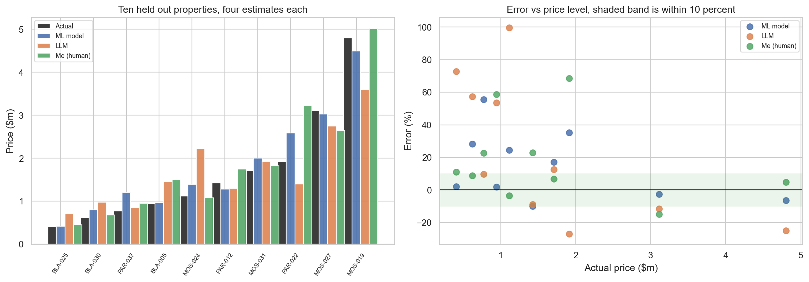

**The model wins the headline metrics, but the detail matters more.** My median absolute
percentage error is 13.0 against the model's 13.5. On the *typical* property I was marginally
better. Its advantage appears in MAE and RMSE, which averages pull around, and in the within
10 percent count. **It does not beat me by being better on the normal house; it beats me by
not making the occasional disaster I do.**

All three over-predict by 14 to 23 percent, which for the model is the Part 4 pattern showing
through. **The LLM fails in a diagnosable way**: twice as bad on every metric, 2 of 10 within
10 percent. It clearly knows Mosman is expensive and Blacktown is not, so Sydney price levels
are in its training data; its failure is pulling every estimate toward the suburb median, so
a modest Mosman apartment comes in far too high and a large house too low. It reasons from a
remembered median rather than the property in front of it. The dangerous part is the
confidence rather than the inaccuracy, since a wrong number delivered with no hedging is
worse than a wide range delivered honestly.

**Does human judgement still add value?** Yes, but not where people usually claim. On
ordinary properties I matched the model and lost on the tail, so its real advantage is
reliability and scale, not insight. Humans earn their place in three things it cannot do:
**knowing when the model is out of its depth** (I can see a one bedroom Mosman apartment
coming and it cannot, at a 77 percent error); **using information not in any column**, since
"deceased estate" is a sentence to me and 40 TF-IDF terms to it; and **accountability**,
because someone must answer for a wrong valuation and that cannot be a Ridge regression. The
sensible design is the model producing the first number and flagging its confidence, with a
human reviewing the low confidence cases.

**Caveat.** Ten properties is tiny and I claim no significance, though the LLM gap is
consistent across all six metrics. The 0.5 point median difference between me and the model
is well inside noise.

\newpage

# Part 6: Deployment and reflection

**Architecture.** A **FastAPI** backend loads the Ridge pipeline at startup, validates input
with Pydantic, and returns a prediction with a confidence band and warnings. A **Streamlit**
front end provides the interface, and can also run the model **in process**, detecting which
mode to use. That fallback exists because free Render services sleep after 15 minutes and
take about 50 seconds to wake, so a marker opening the link during a cold start would
otherwise see an error. It imports the same `predict_one` the API uses, so the paths cannot
drift apart.

Two design decisions came straight from the analysis. The 80 percent interval is computed
from the residual spread of **that specific suburb and property type**, because Part 4 showed
error varies far too much for one global band. And the Part 4 findings are returned as
**warnings in the API response** rather than buried in this report.


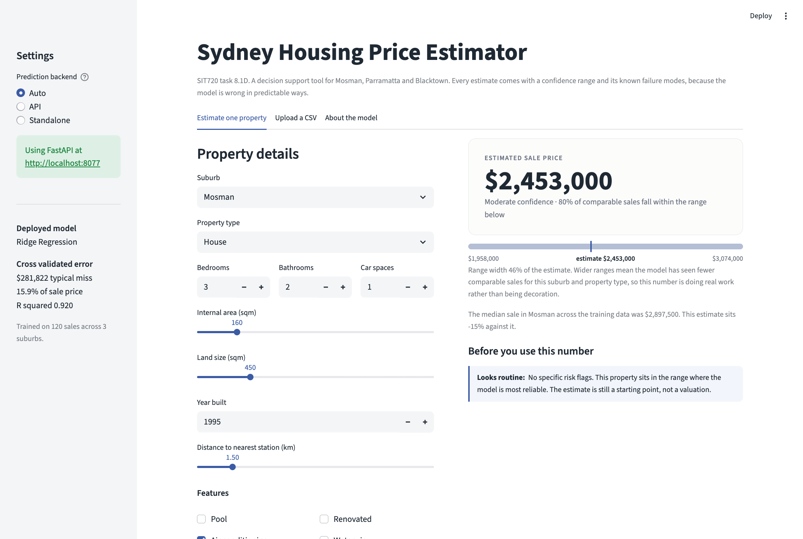

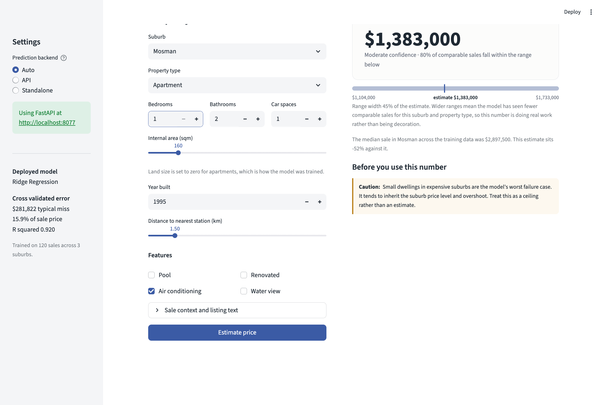

This second screenshot is the behaviour I most wanted. Asked about a one bedroom Mosman
apartment, the exact profile of MOS-016, the tool returns an estimate **and warns that this
is its worst failure case and the number should be read as a ceiling.**

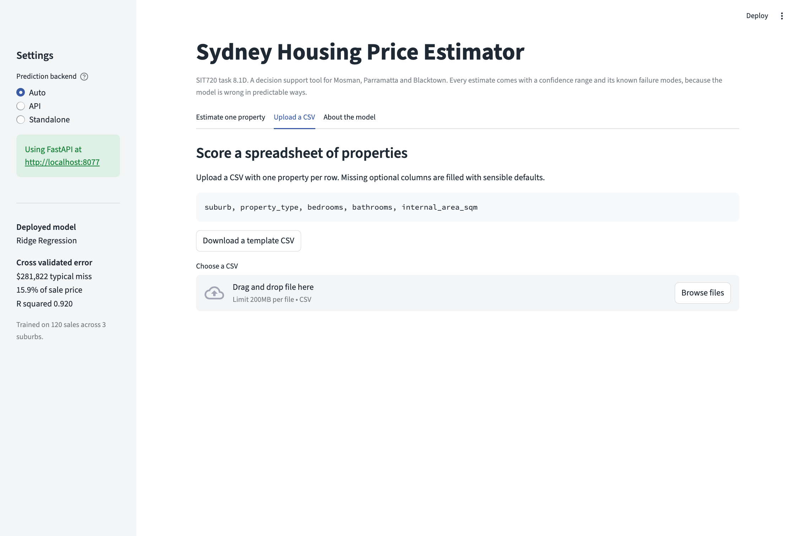

The second tab scores a CSV; only five columns are required and the rest default. The third
tab is a model card with the cross validation results, reliable price range, limitations and
ethics.

## How to build, run and use it

**Reproduce the analysis.** Python 3.9 to 3.12.

```bash
git clone https://github.com/BHASKAR-02/sydney-housing-price-prediction.git
cd sydney-housing-price-prediction
python -m venv .venv && source .venv/bin/activate
pip install -r requirements-dev.txt          # app plus notebook dependencies
jupyter lab notebooks/sydney_housing_analysis.ipynb
```

Run all cells, about 30 seconds. This writes the figures to `outputs/` and the trained
model to `models/`. `requirements-lock.txt` has the exact versions the numbers above came
from; `python src/build_dataset.py` regenerates the dataset.

**Run the application locally.**

```bash
pip install -r requirements.txt              # runtime only
uvicorn backend.main:app --port 8000         # terminal 1, API and Swagger docs at /docs
streamlit run frontend/app.py                # terminal 2, opens on :8501
```

The app finds the API automatically. If the API is not running it loads the model in
process instead, so it works either way.

**Use it.** Fill in the property form and press *Estimate price* for a prediction, an 80
percent range and any risk flags. The *Upload a CSV* tab scores a spreadsheet and returns
a downloadable file; download the template first for the column names. *About the model*
is the model card.

**Deploy it.** The live link above is Streamlit Community Cloud pointed at
`frontend/app.py`, which needs no separate backend because of the in-process fallback.
`deploy/render.yaml` deploys the API to Render if you want both services. Before
redeploying, `scripts/smoke_test.py` checks every path against the runtime dependencies
only, which is what caught two deployment bugs that the local environment hid.

## Reflection

**Hardest part: data collection**, and not for technical reasons. The sites do not want to be
collected from, fields are inconsistent, and the things that most drive price are written in
prose rather than stored as fields. I spent more time deciding what a column should mean than
training models.

**The simplest model won and I predicted it would come last.** Writing that prediction down
first is what made the project useful, because it forced me to find where my reasoning broke
instead of quietly adjusting my expectations to fit the output. **Complexity does not buy
accuracy when data is the constraint:** Gradient Boosting fit its training data perfectly and
came last. At 120 rows the binding constraint is information, not capacity, so another week
would go on collecting rows and columns, not on hyperparameters. **Feature engineering needs
checking, not just doing**: two of my nine features did not work as intended, and I only
found the TF-IDF suburb leak by inspecting importances.

**Deployment broke in ways local testing could not see.** Three separate failures, none of
which appear on a development machine: the host built a Python version with no wheels for my
pinned libraries and silently tried to compile them from source; the saved model was a pickle
tied to the scikit-learn version that wrote it and would not load under the host's newer one;
and a pandas table style I used pulls its colormaps from matplotlib, which I had removed from
the runtime dependencies, failing at render time rather than import time so nothing caught it
early. The fix that mattered was not any individual patch but building
`scripts/smoke_test.py`, which exercises every deployed path against the runtime
dependencies only. The general lesson is that "it works on my machine" is a statement about
one environment, and a deployment is a different one.

**Performance versus deployability.** I got lucky, since the most accurate model was also the
most interpretable. Had Gradient Boosting won narrowly I would still have shipped Ridge,
because a valuation an agent cannot explain is worth less than one slightly less accurate and
defensible.

**Ethics.** Two concerns. *Feedback loops*: if agents set asking prices from the tool, those
influence sale prices, and those sales become next year's training data, the model ends up
validating its own past predictions and any bias gets baked in rather than corrected. *Proxy
features*: `school_catchment_rating` and `distance_to_cbd_km` correlate with the income and
demographic composition of an area, so a model learning "this postcode sells for less" is
partly learning a socioeconomic pattern, and using it to *set* prices rather than describe
them entrenches it. Including no explicitly demographic feature does not make the model
neutral, because the location features carry that information anyway.

A fairness problem is also visible in my own error analysis: the model is least accurate at
both ends of the price range, so it serves first home buyers and prestige vendors worst, and
of those two the group least able to absorb a bad valuation is the first. **An MAE of
$281,822 sounds acceptable until you notice it is not evenly distributed across who gets
harmed by it.**

**With more resources**, in order: several thousand sales rather than 120; latitude and
longitude so the model learns position within a suburb; a comparable sales feature; real
quality grading; stripped suburb names in the text block; and a time series component
modelling the market index separately from the property.

**The limitation that matters most.** Because the data was generated rather than collected,
the models faced an easier problem than production would pose. That a linear model reaches R²
of 0.92 is itself a warning sign, since the generator was close to multiplicative and Ridge
on a log target is close to the right functional form almost by construction. Real accuracy
would be lower and the gaps between models narrower. The workflow, the code and the
conclusions about overfitting and extrapolation hold. The accuracy numbers are an upper bound.

# GenAI acknowledgement

I used Claude (Anthropic) for planning the notebook structure, suggesting engineered features
to try, debugging a scikit-learn `ColumnTransformer` error where my text column was passed as
a DataFrame instead of a Series, and proofreading this report. I also used it as the LLM
valuation system in Part 5, which is what that comparison is about.

All modelling decisions, the suburb selection, the feature engineering rationale, the
interpretation of results and the conclusions are my own. I checked every suggestion against
the actual output before keeping it, and rejected several, including an early recommendation
to drop the outlier properties, which I argue against in Part 2.

# References

Australian Bureau of Statistics 2024, *Residential Property Price Indexes: Eight Capital
Cities*, ABS, Canberra.

Breiman, L 2001, 'Random forests', *Machine Learning*, vol. 45, no. 1, pp. 5 to 32.

Hastie, T, Tibshirani, R & Friedman, J 2009, *The Elements of Statistical Learning*, 2nd edn,
Springer, New York.

NSW Valuer General 2024, *Property Sales Information*, NSW Government, Sydney.

Pedregosa, F et al. 2011, 'Scikit-learn: Machine learning in Python', *Journal of Machine
Learning Research*, vol. 12, pp. 2825 to 2830.

Rosen, S 1974, 'Hedonic prices and implicit markets', *Journal of Political Economy*, vol. 82,
no. 1, pp. 34 to 55.
